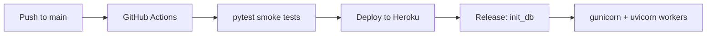

# Deploy Agent Studio to Heroku (CI/CD)

> **Looking for free hosting?** Heroku removed its free tier. Use **[RENDER.md](RENDER.md)** instead ($0 on Render).

This guide sets up **GitHub Actions → Heroku** automatic deployment on every push to `main`.

## Architecture



## 1. Create the Heroku app

```bash
heroku login
heroku apps:create your-agent-studio-name
heroku stack:set heroku-24 -a your-agent-studio-name
```

Enable automatic deploys from GitHub (optional — Actions handles deploy):

```bash
heroku git:remote -a your-agent-studio-name
```

## 2. Set Heroku config vars

Replace values with your own. **All URLs must use HTTPS.**

```bash
heroku config:set APP_SECRET="$(python -c "import secrets; print(secrets.token_urlsafe(48))")" -a your-agent-studio-name
heroku config:set APP_BASE_URL="https://your-agent-studio-name.herokuapp.com" -a your-agent-studio-name
heroku config:set OAUTH_REDIRECT_URI="https://your-agent-studio-name.herokuapp.com/api/gmail/callback" -a your-agent-studio-name
```

### Google OAuth JSON (required for Gmail)

On Heroku there is no `credentials/` folder. Paste the full OAuth client JSON as one config var:

```bash
heroku config:set GOOGLE_CLIENT_SECRETS_JSON='{"web":{"client_id":"...","client_secret":"...","redirect_uris":[],"auth_uri":"https://accounts.google.com/o/oauth2/auth","token_uri":"https://oauth2.googleapis.com/token"}}' -a your-agent-studio-name
```

Tip: minify the JSON to one line, or use the Heroku Dashboard → Settings → Config Vars.

In [Google Cloud Console](https://console.cloud.google.com/), add this **Authorized redirect URI**:

```text
https://your-agent-studio-name.herokuapp.com/api/gmail/callback
```

Enable **Gmail API** and **Google Calendar API**. OAuth scopes used by the app:

- `gmail.readonly`, `gmail.modify`
- `calendar.readonly`, `calendar.events`

### Optional agent integrations

```bash
heroku config:set OPENAI_API_KEY=sk-... -a your-agent-studio-name
heroku config:set TWILIO_ACCOUNT_SID=... TWILIO_AUTH_TOKEN=... TWILIO_FROM_NUMBER=+1... -a your-agent-studio-name
heroku config:set SMTP_HOST=smtp.gmail.com SMTP_USER=... SMTP_PASSWORD=... SMTP_FROM=... -a your-agent-studio-name
```

## 3. GitHub secrets (for CI/CD)

In your GitHub repo → **Settings → Secrets and variables → Actions**, add:

| Secret | Value |
|--------|--------|
| `HEROKU_API_KEY` | From [Heroku Account → API Key](https://dashboard.heroku.com/account) |
| `HEROKU_APP_NAME` | e.g. `your-agent-studio-name` (no URL, just the app name) |
| `HEROKU_EMAIL` | Your Heroku account email |

## 4. Pipeline behavior

Workflow file: [`.github/workflows/heroku-deploy.yml`](.github/workflows/heroku-deploy.yml)

| Event | Action |
|-------|--------|
| Pull request to `main` | Run smoke tests only |
| Push to `main` | Run tests → deploy to Heroku → health check |

### Local files

| File | Purpose |
|------|---------|
| `Procfile` | `release` (DB init) + `web` (gunicorn/uvicorn) |
| `requirements.txt` | Heroku Python buildpack install |
| `runtime.txt` | Python 3.11.9 |
| `app.json` | Heroku Dashboard template / review apps |

## 5. Manual first deploy (optional)

If you want to deploy once before enabling Actions:

```bash
git push heroku main
heroku open -a your-agent-studio-name
heroku logs --tail -a your-agent-studio-name
```

Verify: `https://your-agent-studio-name.herokuapp.com/api/health` → `{"status":"ok"}`

## 6. Important: ephemeral filesystem

Heroku dynos use an **ephemeral disk**. SQLite (`data/agent.db`) and tenant uploads are **lost when the dyno restarts** (deploy, scale, daily restart).

For production persistence, plan to migrate to:

- **Heroku Postgres** for the database
- **S3 / Cloudinary** for tenant file storage

For demos and early testing, the app works on Heroku but treat data as non-durable.

## 7. Troubleshooting

| Issue | Fix |
|-------|-----|
| `Application error` on boot | `heroku logs --tail` — often missing `APP_SECRET` or install failure |
| Gmail OAuth fails | `APP_BASE_URL`, `OAUTH_REDIRECT_URI`, and Google Console URI must match exactly |
| `credentials not found` | Set `GOOGLE_CLIENT_SECRETS_JSON`, not a file path |
| WebSocket disconnects | Heroku supports WebSockets on web dynos; ensure you use `https://` |
| Deploy succeeds but old code | Check GitHub Actions ran; `heroku releases -a your-app` |

## 8. Production checklist

- [ ] `APP_BASE_URL` and `OAUTH_REDIRECT_URI` use your Heroku HTTPS URL
- [ ] `APP_SECRET` is a long random string (not the default)
- [ ] `GOOGLE_CLIENT_SECRETS_JSON` is set
- [ ] Google OAuth redirect URI matches Heroku URL
- [ ] GitHub secrets configured
- [ ] `/api/health` returns OK after deploy
- [ ] Sign-up, login, and Gmail connect tested on production URL
