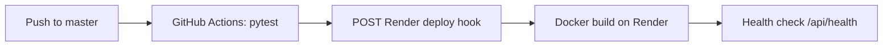

# Deploy Aivana (Agent Studio) on Render — Free + CI/CD

Repo: **https://github.com/dudu-krish/aivana**

| | |
|---|---|
| **Cost** | Free tier ($0) |
| **CI/CD** | GitHub Actions → tests → Render deploy hook |
| **Catch** | App sleeps after ~15 min idle; SQLite is ephemeral |

## Pipeline



Workflow file: [`.github/workflows/render-deploy.yml`](.github/workflows/render-deploy.yml)

---

## One-time setup

### 1. Create the Render service

1. Sign up at [render.com](https://render.com) → connect **GitHub** → authorize `dudu-krish/aivana`
2. **New → Blueprint** → select repo `dudu-krish/aivana` → Render reads `render.yaml`
3. Or **New Web Service** → Docker → branch `master` → plan **Free**

`render.yaml` sets `autoDeploy: false` so **only GitHub Actions** deploys after tests pass.

### 2. Set environment variables (Render dashboard)

| Variable | Example |
|----------|---------|
| `APP_BASE_URL` | `https://aivana.onrender.com` |
| `OAUTH_REDIRECT_URI` | `https://aivana.onrender.com/api/gmail/callback` |
| `GOOGLE_CLIENT_SECRETS_JSON` | Full Google OAuth JSON (one line) |

`APP_SECRET` is auto-generated by the blueprint.

### 3. Google Cloud OAuth

Add to **Authorized redirect URIs**:

```text
https://YOUR-SERVICE.onrender.com/api/gmail/callback
```

OAuth consent screen scopes:

- `gmail.readonly`, `gmail.modify`
- `calendar.readonly`, `calendar.events`

### 4. GitHub Actions secrets

Repo → **Settings → Secrets and variables → Actions**:

| Secret | Where to get it |
|--------|-----------------|
| `RENDER_DEPLOY_HOOK` | Render → your service → **Settings → Deploy Hook** → copy URL |
| `RENDER_SERVICE_URL` | Your public URL, e.g. `https://aivana.onrender.com` |

Optional: create a **production** environment under Settings → Environments for approval gates.

### 5. First deploy

Push to `master`:

```bash
git push origin master
```

Or trigger manually: Actions → **CI/CD — Render** → **Run workflow**

---

## Verify

```bash
curl https://YOUR-SERVICE.onrender.com/api/health
# {"status":"ok"}
```

---

## Optional env vars

```env
OPENAI_API_KEY=sk-...
TWILIO_ACCOUNT_SID=...
TWILIO_AUTH_TOKEN=...
TWILIO_FROM_NUMBER=+1...
TWILIO_WHATSAPP_FROM=whatsapp:+14155238886
SMTP_HOST=smtp.gmail.com
SMTP_USER=...
SMTP_PASSWORD=...
SMTP_FROM=...
```

---

## Troubleshooting

| Issue | Fix |
|-------|-----|
| Actions deploy fails — no hook | Set `RENDER_DEPLOY_HOOK` in GitHub secrets |
| Actions green but site unchanged | Hook must be from **Web Service → Settings → Deploy Hook**, not the Blueprint hook (Blueprint returns `sync started` and does not rebuild the app) |
| Health check timeout | Free tier cold start can take 2–3 min; workflow waits up to 6 min |
| Gmail OAuth fails | Match `APP_BASE_URL` / redirect URI with Google Console exactly |
| Double deploys | Keep `autoDeploy: false` in `render.yaml` |
| Data lost on redeploy | Expected on free tier — add Render Postgres later |

---

## Manual deploy (without Actions)

Render dashboard → your service → **Manual Deploy → Deploy latest commit**

Or:

```bash
curl -X POST "YOUR_DEPLOY_HOOK_URL"
```
